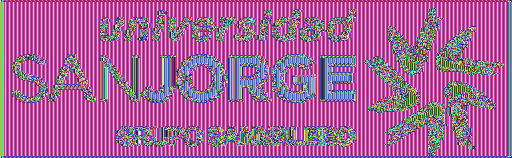

# Modes of Operation in Cryptography

This project demonstrates how different cipher algorithm **modes of operation** work in cryptography.

Specifically, it showcases the encryption of an input BMP image using **DES** and **AES** ciphers with the **ECB (Electronic Code Book)** and **CBC (Cipher Block Chaining)** modes of operation.

Modes of operation define how a block cipher encrypts data. The two modes covered in this project are:

- **ECB (Electronic Code Book)**: Each block of data is encrypted independently, which can result in patterns from the plaintext being visible in the ciphertext (especially for images).
- **CBC (Cipher Block Chaining)**: Each block of data is XORed with the previous block before encryption, providing better security by eliminating identical ciphertext blocks for identical plaintext blocks.

The project encrypts an input BMP image and produces new BMP files that show the effects of encryption using these modes of operation.

## Requirements

To run this project, ensure that you have the following software installed:
- **Java 11** or later
- **Maven 3.5** or later

## Building the Project

To build the project, run the following command from the project root:

```bash
$ mvn clean package
```

This will compile the code and package it into a runnable format.

## Running the Project

After building the project, you can run it with the following command:

```bash
$ java -cp target/classes es.usj.crypto.cipher.ModesOfOperationApp
```

This will execute the encryption process on the input BMP file located in the `resources` folder. The project encrypts the image using both DES and AES with ECB and CBC modes of operation.

### Output Folder

The encrypted images will be stored in the output folder specified by the `OUTPUT_FOLDER` constant in the main Java class (`ModesOfOperationApp`). You can modify this folder location to suit your system by updating the `OUTPUT_FOLDER` value.

## Sample Produced Images

Here are some sample images produced by the project, showing the original image and the images encrypted with different cipher modes:

### Original Image

The input BMP image before encryption:


### Encrypted Images

#### DES Cipher with ECB Mode of Operation

In ECB mode, each block of the image is encrypted independently, resulting in noticeable visual patterns when encrypting images:


#### AES Cipher with ECB Mode of Operation

AES is a stronger cipher than DES, but ECB mode still shows patterns, which can make it unsuitable for some applications:



#### DES Cipher with CBC Mode of Operation

In CBC mode, each block depends on the encryption of the previous block, making the resulting encrypted image more secure and less predictable:


#### AES Cipher with CBC Mode of Operation

AES combined with CBC mode results in a more secure encryption, and no discernible patterns are visible in the output image:

